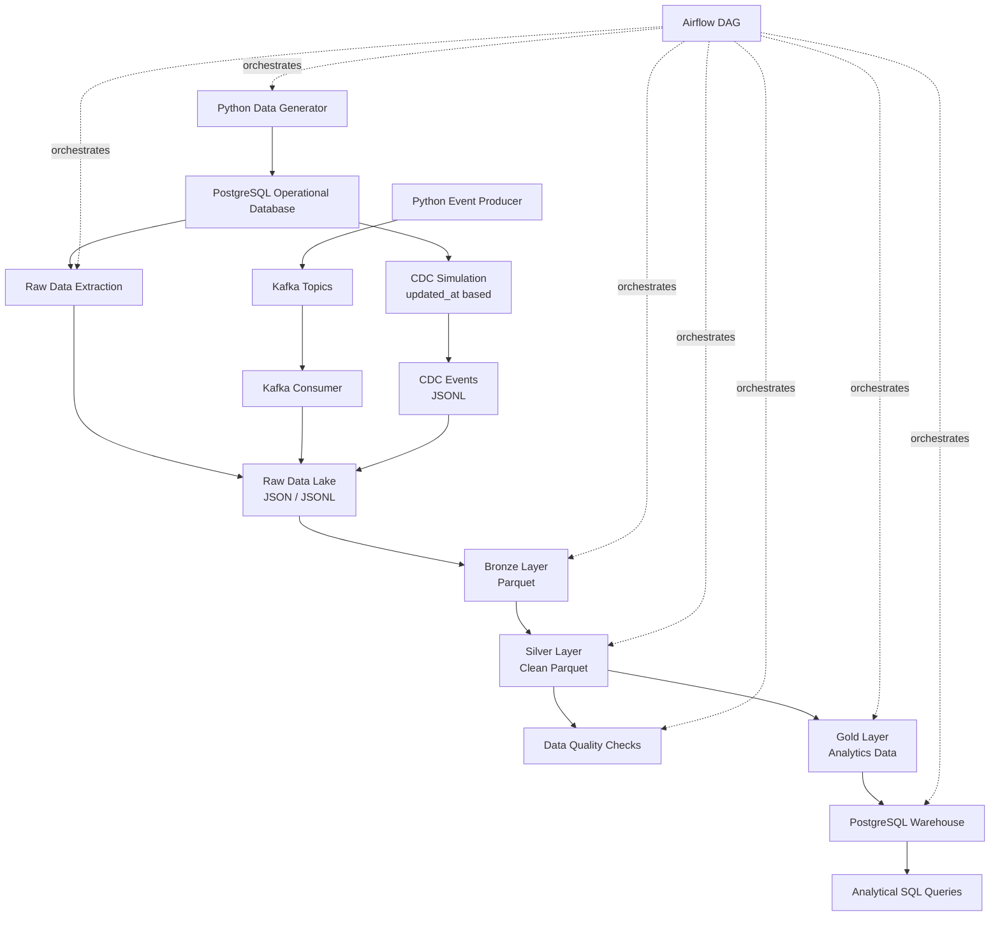

# Architecture

This project is an end-to-end ecommerce data platform inspired by marketplace-scale data flows.

The platform simulates operational ecommerce data, extracts it into a raw data lake, transforms it through lakehouse layers, validates data quality, builds warehouse models, runs analytical SQL queries, and supports Kafka-based event streaming and CDC simulation.

---

## High-Level Architecture

```text
Python Data Generator
        ↓
PostgreSQL Operational Database
        ↓
Raw Data Extraction
        ↓
Raw Data Lake - JSON / JSONL
        ↓
Bronze Layer - Parquet
        ↓
Silver Layer - Clean Parquet
        ↓
Data Quality Checks
        ↓
Gold Layer - Analytics Data
        ↓
PostgreSQL Warehouse
        ↓
Analytical SQL Queries
```

---

## Architecture Diagram



---

## Batch Data Flow

The batch pipeline is responsible for moving operational ecommerce data into analytical layers.

```text
PostgreSQL Tables
        ↓
Raw JSON Files
        ↓
Bronze Parquet Datasets
        ↓
Silver Clean Parquet Datasets
        ↓
Gold Analytics Datasets
        ↓
Warehouse Fact and Dimension Tables
```

| Component | Responsibility |
|---|---|
| `apps/data_generator` | Generates synthetic ecommerce data |
| `pipelines/extract` | Extracts PostgreSQL tables into raw JSON files |
| `pipelines/transform` | Runs Pandas-based lakehouse transformations |
| `spark/jobs` | Runs Spark-based lakehouse transformations |
| `pipelines/quality` | Runs data quality checks |
| `pipelines/load` | Builds warehouse fact and dimension models |
| `warehouse/analytics` | Contains business SQL queries |

---

## Streaming Architecture

The streaming pipeline simulates real-time ecommerce events.

```text
Python Event Producer
        ↓
Kafka Topics
        ↓
Kafka Consumer
        ↓
Raw Data Lake - JSONL Events
```

Kafka topics:

- `product_viewed`
- `cart_updated`
- `order_created`
- `payment_completed`

| Component | Responsibility |
|---|---|
| `apps/event_producer` | Produces synthetic ecommerce events |
| `kafka/consumers` | Consumes Kafka events and writes them to raw data lake |
| `kafka/topics` | Documents Kafka topic design |
| `docker-compose.yml` | Runs Kafka and Kafka UI locally |

Kafka UI:

```text
http://localhost:8085
```

---

## CDC Simulation Architecture

The CDC simulation captures changed records from PostgreSQL using `updated_at` columns.

```text
PostgreSQL Tables
        ↓
updated_at-based Change Detection
        ↓
CDC Event Builder
        ↓
data_lake/raw/cdc_events/*.jsonl
```

| Component | Responsibility |
|---|---|
| `pipelines/cdc/cdc_state.py` | Stores and reads the last CDC run timestamp |
| `pipelines/cdc/postgres_cdc_simulator.py` | Detects changed rows and writes CDC events |
| `scripts/run_cdc_simulation.sh` | Runs CDC simulation locally |

Current CDC condition:

```sql
updated_at > last_run_at
AND updated_at <= current_run_at
```

This is an MVP CDC simulation. A future production-style version can use:

```text
PostgreSQL WAL
        ↓
Debezium
        ↓
Kafka Topics
        ↓
Raw Data Lake
```

---

## Lakehouse Layers

The project follows a simple lakehouse-style structure.

| Layer | Format | Description |
|---|---|---|
| Raw | JSON / JSONL | Source data stored as extracted or consumed |
| Bronze | Parquet | Formatted data optimized for processing |
| Silver | Parquet | Cleaned and standardized data |
| Gold | JSON / Parquet | Analytics-ready datasets |

---

## Raw Layer

The raw layer stores source-aligned data.

Examples:

```text
data_lake/raw/orders/orders_YYYY_MM_DD_HHMMSS.json
data_lake/raw/payments/payments_YYYY_MM_DD_HHMMSS.json
data_lake/raw/kafka_events/kafka_events_YYYY_MM_DD_HHMMSS.jsonl
data_lake/raw/cdc_events/cdc_events_YYYY_MM_DD_HHMMSS.jsonl
```

---

## Bronze Layer

The bronze layer stores formatted Parquet datasets.

Examples:

```text
data_lake/bronze/orders/
data_lake/bronze/payments/
data_lake/bronze/click_events/
```

---

## Silver Layer

The silver layer stores cleaned Parquet datasets.

Cleaning examples:

- Timestamp standardization
- Duplicate removal
- Null checks for critical identifiers
- Negative amount filtering
- Invalid event timestamp filtering

Examples:

```text
data_lake/silver/orders/
data_lake/silver/payments/
data_lake/silver/click_events/
```

---

## Gold Layer

The gold layer contains analytics-ready datasets.

Examples:

```text
data_lake/gold/gold_daily_sales/
data_lake/gold/gold_category_sales/
data_lake/gold/gold_payment_summary/
data_lake/gold/gold_conversion_funnel/
```

---

## Warehouse Architecture

The warehouse layer is built in PostgreSQL under the `warehouse` schema.

```text
Operational PostgreSQL Tables
        ↓
Warehouse SQL Models
        ↓
Dimension Tables + Fact Tables
        ↓
Business Analytics Queries
```

Dimension tables:

- `warehouse.dim_users`
- `warehouse.dim_categories`
- `warehouse.dim_sellers`
- `warehouse.dim_products`
- `warehouse.dim_date`

Fact tables:

- `warehouse.fact_orders`
- `warehouse.fact_payments`
- `warehouse.fact_shipments`
- `warehouse.fact_returns`
- `warehouse.fact_clickstream`

---

## Airflow Orchestration

Airflow is used to define the end-to-end orchestration flow.

DAG file:

```text
dags/ecommerce_data_pipeline.py
```

DAG flow:

```text
start
  ↓
generate_data
  ↓
extract_postgres_data
  ↓
write_raw_layer
  ↓
transform_raw_to_bronze
  ↓
transform_bronze_to_silver
  ↓
run_quality_checks
  ↓
build_gold_tables
  ↓
load_warehouse
  ↓
end
```

The DAG connects individual scripts into a single pipeline that can be scheduled and monitored.

---

## Data Quality Architecture

Data quality checks are applied after the Silver layer.

```text
Silver Data
        ↓
Quality Rules
        ↓
Quality Report JSON
        ↓
Gold / Warehouse Usage
```

Current checks include:

- `order_id_not_null`
- `duplicate_orders`
- `payment_amount_non_negative`
- `order_total_matches_order_items`
- `delivered_shipments_have_delivered_at`
- `returns_have_valid_orders`
- `event_timestamp_not_in_future`

Quality reports are written to:

```text
data_lake/quality_reports/
```

---

## CI/CD Architecture

GitHub Actions validates the project automatically.

Workflow file:

```text
.github/workflows/ci.yml
```

CI checks:

- Black formatting
- Ruff linting
- Pytest tests
- SQL file validation
- Docker Compose config validation
- ShellCheck validation

---

## Repository Structure

```text
apps/
  data_generator/
  event_producer/

database/
  postgres/
  seeds/

pipelines/
  extract/
  transform/
  quality/
  load/
  cdc/

spark/
  jobs/
  utils/

kafka/
  consumers/
  topics/

warehouse/
  marts/
  analytics/
  staging/

data_lake/
  raw/
  bronze/
  silver/
  gold/
  quality_reports/

dags/
  ecommerce_data_pipeline.py

scripts/
  *.sh

docs/
  architecture.md
  data_model.md
  pipeline_design.md
  data_quality.md
  how_to_run.md
  sample_outputs.md

.github/
  workflows/
```

---

## Design Notes

This project intentionally combines multiple data engineering patterns:

- Batch ingestion
- Streaming ingestion
- CDC simulation
- Lakehouse-style processing
- Data quality validation
- Warehouse modeling
- SQL analytics
- Airflow orchestration
- CI/CD validation

The goal is to demonstrate how a Data Developer can build and explain an end-to-end data platform from source systems to business-ready analytics.