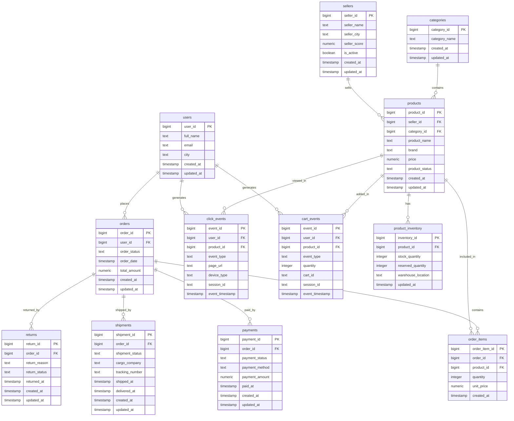
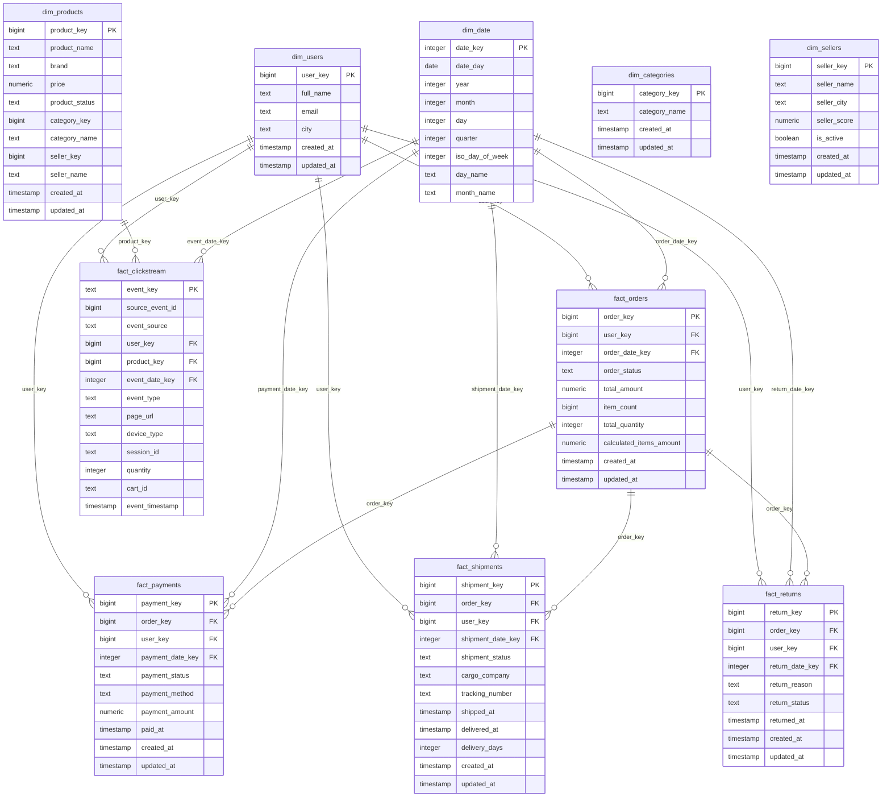

# Data Model

This document describes the data model used in the ecommerce data platform.

The project contains two main data model layers:

1. **Operational PostgreSQL model**
2. **Warehouse fact and dimension model**

---

## Overview

The operational model represents source-system ecommerce data such as users, sellers, products, orders, payments, shipments, returns and user events.

The warehouse model transforms this operational data into analytics-friendly fact and dimension tables.

```text
Operational PostgreSQL Tables
        ↓
Warehouse SQL Models
        ↓
Dimension Tables + Fact Tables
        ↓
Analytical SQL Queries
```

---

## Operational Data Model

Operational tables are created in PostgreSQL by:

```text
database/postgres/001_init_schema.sql
```

These tables simulate source systems of an ecommerce marketplace.

| Table | Description |
|---|---|
| `users` | Customer information |
| `sellers` | Marketplace seller information |
| `categories` | Product category information |
| `products` | Product catalog |
| `product_inventory` | Product stock and warehouse information |
| `orders` | Customer order records |
| `order_items` | Product line items inside each order |
| `payments` | Payment attempts and payment statuses |
| `shipments` | Shipment, cargo and delivery records |
| `returns` | Product return requests and statuses |
| `click_events` | User clickstream events |
| `cart_events` | User cart interaction events |

---

## Operational Entity Relationship Diagram



---

## Core Operational Relationships

| Relationship | Meaning |
|---|---|
| `users` → `orders` | One user can place many orders |
| `orders` → `order_items` | One order can contain many products |
| `products` → `order_items` | One product can appear in many order lines |
| `categories` → `products` | One category can contain many products |
| `sellers` → `products` | One seller can sell many products |
| `products` → `product_inventory` | One product can have inventory records |
| `orders` → `payments` | One order can have one or more payment records |
| `orders` → `shipments` | One order can have shipment records |
| `orders` → `returns` | One order can have return records |
| `users` → `click_events` | One user can generate many click events |
| `users` → `cart_events` | One user can generate many cart events |
| `products` → `click_events` | One product can appear in many click events |
| `products` → `cart_events` | One product can appear in many cart events |

---

## Important Operational Fields

### Status Fields

| Table | Field | Example Values |
|---|---|---|
| `orders` | `order_status` | `created`, `paid`, `packed`, `shipped`, `delivered`, `cancelled` |
| `products` | `product_status` | `active`, `inactive`, `out_of_stock` |
| `payments` | `payment_status` | `success`, `failed`, `refunded` |
| `shipments` | `shipment_status` | `preparing`, `shipped`, `delivered`, `delayed` |
| `returns` | `return_status` | `requested`, `approved`, `rejected`, `completed` |
| `click_events` | `event_type` | `homepage_viewed`, `category_viewed`, `product_viewed`, `search_performed`, `product_favorited` |
| `cart_events` | `event_type` | `cart_created`, `product_added_to_cart`, `product_removed_from_cart`, `cart_quantity_updated`, `checkout_started` |

### Timestamp Fields

| Field | Purpose |
|---|---|
| `created_at` | Record creation timestamp |
| `updated_at` | Record update timestamp, also used by CDC simulation |
| `order_date` | Order creation date |
| `paid_at` | Payment success timestamp |
| `shipped_at` | Shipment start timestamp |
| `delivered_at` | Delivery completion timestamp |
| `returned_at` | Return timestamp |
| `event_timestamp` | Clickstream or cart event timestamp |

---

## Warehouse Data Model

Warehouse models are created by:

```text
warehouse/marts/001_create_fact_dimension_tables.sql
```

The warehouse layer is built in PostgreSQL under the `warehouse` schema.

```text
warehouse.dim_users
warehouse.dim_products
warehouse.dim_categories
warehouse.dim_sellers
warehouse.dim_date

warehouse.fact_orders
warehouse.fact_payments
warehouse.fact_shipments
warehouse.fact_returns
warehouse.fact_clickstream
```

---

## Dimension Tables

Dimension tables describe business entities.

| Table | Grain | Description |
|---|---|---|
| `warehouse.dim_users` | One row per user | User attributes |
| `warehouse.dim_categories` | One row per category | Category attributes |
| `warehouse.dim_sellers` | One row per seller | Seller attributes |
| `warehouse.dim_products` | One row per product | Product, category and seller attributes |
| `warehouse.dim_date` | One row per date | Calendar attributes |

---

## Fact Tables

Fact tables store measurable business events.

| Table | Grain | Description |
|---|---|---|
| `warehouse.fact_orders` | One row per order | Order totals, item count and quantity metrics |
| `warehouse.fact_payments` | One row per payment | Payment amount, method and status |
| `warehouse.fact_shipments` | One row per shipment | Shipment status and delivery duration |
| `warehouse.fact_returns` | One row per return | Return status and reason |
| `warehouse.fact_clickstream` | One row per event | Unified click and cart event facts |

---

## Warehouse Star Schema



---

## Warehouse Metrics

### `warehouse.fact_orders`

| Metric | Description |
|---|---|
| `total_amount` | Order total from operational `orders` table |
| `item_count` | Number of order item rows |
| `total_quantity` | Total product quantity in the order |
| `calculated_items_amount` | Sum of `quantity * unit_price` from order items |

### `warehouse.fact_payments`

| Metric | Description |
|---|---|
| `payment_amount` | Payment amount |
| `payment_status` | Payment result |
| `payment_method` | Payment channel |

### `warehouse.fact_shipments`

| Metric | Description |
|---|---|
| `delivery_days` | Difference between `delivered_at` and `shipped_at` |
| `shipment_status` | Shipment state |
| `cargo_company` | Cargo provider |

### `warehouse.fact_clickstream`

| Metric | Description |
|---|---|
| `event_type` | Clickstream or cart event type |
| `event_source` | `click_event` or `cart_event` |
| `session_id` | User session identifier |
| `quantity` | Cart quantity for cart events |

---

## Analytical Questions Supported

The warehouse model supports marketplace analytics questions such as:

| Business Question | Main Tables |
|---|---|
| What is the daily revenue? | `fact_orders`, `dim_date` |
| What are the top selling categories? | `fact_orders`, `dim_products`, `order_items` |
| What is the cart abandonment rate? | `fact_clickstream`, `fact_orders` |
| Which categories have the highest return rate? | `fact_returns`, `dim_products`, `order_items` |
| What is the payment failure rate? | `fact_payments` |
| Do late shipments increase return rate? | `fact_shipments`, `fact_returns` |

Analytical SQL files are located in:

```text
warehouse/analytics/
```

---

## Data Model Notes

### Synthetic Data Behavior

The data is generated by Python scripts under:

```text
apps/data_generator/
```

Some synthetic values are intentionally simplified.

For example:

```text
orders.total_amount and order_items totals are generated independently.
```

This means the following data quality check may fail:

```text
order_total_matches_order_items
```

This is useful because it demonstrates that the data quality layer can detect business-level consistency issues.

### CDC Support

Tables with `updated_at` fields can be used by the CDC simulation.

Examples:

- `users`
- `sellers`
- `categories`
- `products`
- `product_inventory`
- `orders`
- `payments`
- `shipments`
- `returns`

CDC output is written to:

```text
data_lake/raw/cdc_events/
```

### Event Modeling

The project currently keeps click and cart events in operational PostgreSQL tables for MVP simplicity.

In a more production-style setup:

```text
Click / Cart Events
        ↓
Kafka Topics
        ↓
Raw Data Lake
        ↓
Streaming Transformations
        ↓
Analytics / Warehouse
```

---

## Future Improvements

Potential improvements to the data model:

- Add slowly changing dimensions
- Add surrogate warehouse keys independent of source IDs
- Add dbt models for transformations
- Add incremental warehouse loading
- Add partitioning strategy for large fact tables
- Add event sessionization logic
- Add product price history
- Add seller performance mart
- Add customer lifetime value mart