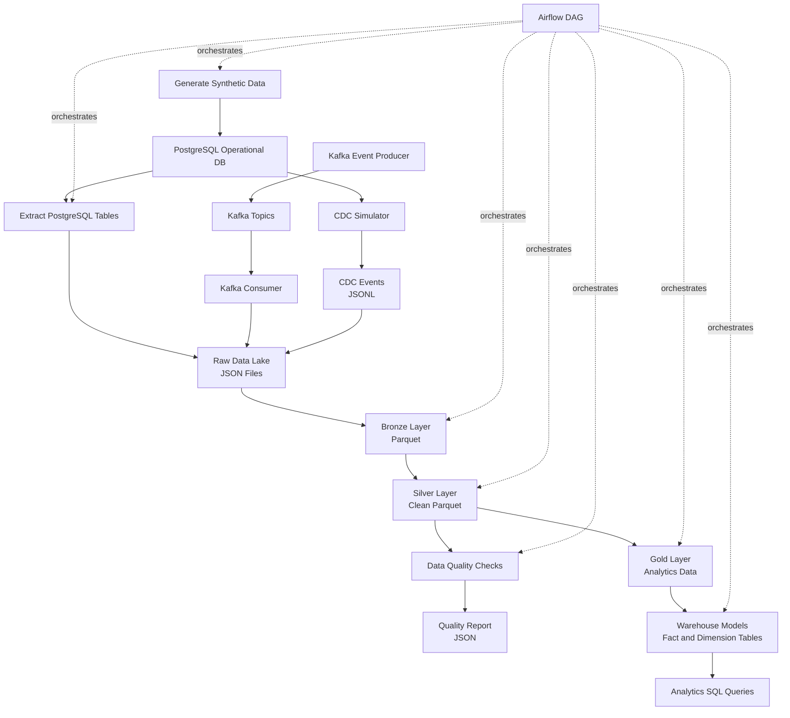
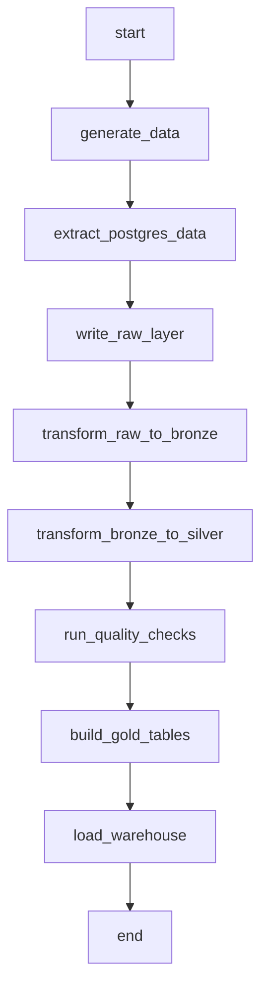

# Pipeline Design

This document explains the main pipeline flows in the ecommerce data platform.

The project includes multiple pipeline patterns:

- Batch data pipeline
- Lakehouse transformation pipeline
- Spark transformation pipeline
- Data quality pipeline
- Warehouse loading pipeline
- Kafka streaming pipeline
- CDC simulation pipeline
- Airflow orchestration flow

---

## Pipeline Overview

```text
Synthetic Data Generator
        ↓
PostgreSQL Operational Database
        ↓
Raw Extraction
        ↓
Raw Data Lake
        ↓
Bronze Layer
        ↓
Silver Layer
        ↓
Data Quality Checks
        ↓
Gold Layer
        ↓
Warehouse Models
        ↓
Analytics Queries
```

---

## Pipeline Diagram



---

## 1. Synthetic Data Generation

The first step creates synthetic ecommerce data and loads it into PostgreSQL.

### Command

```bash
python -m apps.data_generator.main
```

### Input

No external input is required.

The generator uses Python and Faker to create synthetic records.

### Output

Data is inserted into PostgreSQL operational tables:

| Entity | PostgreSQL Table |
|---|---|
| Users | `users` |
| Sellers | `sellers` |
| Categories | `categories` |
| Products | `products` |
| Product inventory | `product_inventory` |
| Orders | `orders` |
| Order items | `order_items` |
| Payments | `payments` |
| Shipments | `shipments` |
| Returns | `returns` |
| Click events | `click_events` |
| Cart events | `cart_events` |

### Example Output

```text
Starting synthetic ecommerce data generation...
Inserted categories: 8
Inserted sellers: 30
Inserted users: 100
Inserted products: 200
Inserted product_inventory: 200
Inserted orders: 300
Inserted order_items: 700
Inserted payments: 300
Inserted shipments: 250
Inserted returns: 50
Inserted click_events: 1000
Inserted cart_events: 500
Synthetic ecommerce data generation completed.
```

---

## 2. Raw Data Extraction

This step extracts PostgreSQL source tables into the raw data lake.

### Command

```bash
python -m pipelines.extract.extract_postgres_to_raw
```

or:

```bash
./scripts/extract_raw.sh
```

### Input

PostgreSQL operational tables.

### Output

Raw JSON files under:

```text
data_lake/raw/<table_name>/<table_name>_YYYY_MM_DD_HHMMSS.json
```

Example:

```text
data_lake/raw/orders/orders_YYYY_MM_DD_HHMMSS.json
data_lake/raw/payments/payments_YYYY_MM_DD_HHMMSS.json
data_lake/raw/click_events/click_events_YYYY_MM_DD_HHMMSS.json
```

### Design Notes

The raw layer stores data close to its source format.

Raw data is not committed to Git.

---

## 3. Pandas Lakehouse Transformations

The Pandas transformation pipeline processes raw JSON into Bronze, Silver and Gold layers.

### Command

```bash
python -m pipelines.transform.run_lakehouse_transformations
```

or:

```bash
./scripts/run_lakehouse_transformations.sh
```

### Flow

```text
Raw JSON
  ↓
Bronze Parquet
  ↓
Silver Clean Parquet
  ↓
Gold Analytics JSON
```

### Bronze Layer

Bronze converts raw JSON into Parquet format.

Output:

```text
data_lake/bronze/<table_name>/<table_name>.parquet
```

### Silver Layer

Silver applies cleaning and standardization.

Cleaning examples:

- Timestamp conversion
- Duplicate removal
- Critical null filtering
- Negative amount filtering
- Invalid event timestamp filtering

Output:

```text
data_lake/silver/<table_name>/<table_name>.parquet
```

### Gold Layer

Gold creates analytics-ready datasets.

Current Gold datasets:

| Dataset | Description |
|---|---|
| `gold_daily_sales` | Daily order count, revenue and average order value |
| `gold_category_sales` | Revenue and quantity by category |
| `gold_payment_summary` | Payment summary by status and method |
| `gold_conversion_funnel` | Product view, cart add and purchase funnel |

Output:

```text
data_lake/gold/<dataset_name>/<dataset_name>.json
```

---

## 4. Spark Lakehouse Transformations

The Spark transformation pipeline provides a scalable alternative to the Pandas pipeline.

### Command

```bash
./scripts/run_spark_transformations.sh
```

### Flow

```text
Raw JSON
  ↓
Bronze Parquet
  ↓
Silver Clean Parquet
  ↓
Gold Analytics Parquet
```

### Why Spark?

Pandas is useful for local development and small datasets.

Spark is used to demonstrate scalable transformation logic for larger data volumes.

### Output

Spark writes folder-based Parquet datasets:

```text
data_lake/bronze/orders/part-*.parquet
data_lake/silver/orders/part-*.parquet
data_lake/gold/gold_daily_sales_spark/part-*.parquet
```

### Java Requirement

Spark transformations require Java 17.

The helper script tries to use Homebrew Java 17 automatically on macOS.

---

## 5. Data Quality Pipeline

The data quality pipeline validates Silver data before it is used downstream.

### Command

```bash
python -m pipelines.quality.run_quality_checks
```

or:

```bash
./scripts/run_quality_checks.sh
```

### Flow

```text
Silver Data
    ↓
Quality Checks
    ↓
Quality Report JSON
```

### Current Checks

| Check | Rule |
|---|---|
| `order_id_not_null` | `order_id` must not be null |
| `duplicate_orders` | `order_id` must be unique |
| `payment_amount_non_negative` | `payment_amount >= 0` |
| `order_total_matches_order_items` | Order total should match item-level total |
| `delivered_shipments_have_delivered_at` | Delivered shipments must have `delivered_at` |
| `returns_have_valid_orders` | Returns must reference valid orders |
| `event_timestamp_not_in_future` | Event timestamps must not be in the future |

### Output

```text
data_lake/quality_reports/quality_report_YYYY_MM_DD_HHMMSS.json
```

### Expected Synthetic Data Behavior

The current synthetic generator may produce one expected failed check:

```text
order_total_matches_order_items
```

Reason:

```text
orders.total_amount and order_items totals are generated independently.
```

This demonstrates that the quality layer can detect business-level consistency issues.

---

## 6. Warehouse Loading Pipeline

The warehouse loading step builds fact and dimension models in PostgreSQL.

### Command

```bash
python -m pipelines.load.warehouse_loader
```

or:

```bash
./scripts/load_warehouse.sh
```

### Input

Operational PostgreSQL tables.

### Output

Warehouse tables under PostgreSQL schema:

```text
warehouse.*
```

### Dimension Tables

| Table | Description |
|---|---|
| `warehouse.dim_users` | User dimension |
| `warehouse.dim_categories` | Category dimension |
| `warehouse.dim_sellers` | Seller dimension |
| `warehouse.dim_products` | Product dimension |
| `warehouse.dim_date` | Date dimension |

### Fact Tables

| Table | Description |
|---|---|
| `warehouse.fact_orders` | Order-level facts |
| `warehouse.fact_payments` | Payment facts |
| `warehouse.fact_shipments` | Shipment facts |
| `warehouse.fact_returns` | Return facts |
| `warehouse.fact_clickstream` | Unified click and cart event facts |

---

## 7. Analytics Query Pipeline

The analytics query layer answers marketplace-style business questions.

### Command

```bash
./scripts/run_analytics_queries.sh
```

### Query Files

```text
warehouse/analytics/
```

### Business Questions

| Business Question | SQL File |
|---|---|
| What is the daily revenue? | `01_daily_revenue.sql` |
| What are the top selling categories? | `02_top_selling_categories.sql` |
| What is the cart abandonment rate? | `03_cart_abandonment_rate.sql` |
| Which categories have the highest return rate? | `04_return_rate_by_category.sql` |
| What is the payment failure rate? | `05_payment_failure_rate.sql` |
| Do late shipments increase return rate? | `06_late_shipment_return_impact.sql` |

---

## 8. Kafka Streaming Pipeline

The Kafka pipeline simulates real-time ecommerce events.

### Flow

```text
Python Event Producer
        ↓
Kafka Topics
        ↓
Kafka Consumer
        ↓
Raw Data Lake - JSONL
```

### Producer Command

```bash
./scripts/run_kafka_producer.sh
```

### Consumer Command

```bash
./scripts/run_kafka_consumer.sh
```

### Kafka Topics

| Topic | Description |
|---|---|
| `product_viewed` | Product detail page view event |
| `cart_updated` | Cart add, remove or quantity update event |
| `order_created` | Order creation event |
| `payment_completed` | Payment completion or failure event |

### Output

```text
data_lake/raw/kafka_events/kafka_events_YYYY_MM_DD_HHMMSS.jsonl
```

Kafka event files are ignored by Git.

---

## 9. CDC Simulation Pipeline

The CDC pipeline simulates change data capture from PostgreSQL using `updated_at` columns.

### Command

```bash
./scripts/run_cdc_simulation.sh
```

### Flow

```text
PostgreSQL Tables
        ↓
updated_at-based Change Detection
        ↓
CDC Event Builder
        ↓
Raw CDC Events - JSONL
```

### CDC Condition

```sql
updated_at > last_run_at
AND updated_at <= current_run_at
```

### State File

```text
data_lake/raw/cdc_state/state.json
```

### Output

```text
data_lake/raw/cdc_events/cdc_events_YYYY_MM_DD_HHMMSS.jsonl
```

### Design Notes

This is an MVP CDC simulation.

A future production-style implementation can use:

```text
PostgreSQL WAL
        ↓
Debezium
        ↓
Kafka Topics
        ↓
Raw Data Lake
```

---

## 10. Airflow Orchestration

The Airflow DAG connects pipeline tasks into one orchestrated flow.

### DAG File

```text
dags/ecommerce_data_pipeline.py
```

### DAG Flow

```text
start
  ↓
generate_data
  ↓
extract_postgres_data
  ↓
write_raw_layer
  ↓
transform_raw_to_bronze
  ↓
transform_bronze_to_silver
  ↓
run_quality_checks
  ↓
build_gold_tables
  ↓
load_warehouse
  ↓
end
```

### DAG Diagram



### DAG Check

```bash
./scripts/check_airflow_dag_import.sh
```

This only validates the DAG file. It does not run the full pipeline.

---

## 11. Full Local Batch Pipeline

### Pandas Flow

```bash
./scripts/reset_env.sh
source .venv/bin/activate
pip install -r requirements.txt

python -m apps.data_generator.main
./scripts/extract_raw.sh
./scripts/run_lakehouse_transformations.sh
./scripts/run_quality_checks.sh
./scripts/load_warehouse.sh
./scripts/run_analytics_queries.sh
```

### Spark Flow

```bash
./scripts/reset_env.sh
source .venv/bin/activate
pip install -r requirements.txt

python -m apps.data_generator.main
./scripts/extract_raw.sh
./scripts/run_spark_transformations.sh
./scripts/run_quality_checks.sh
./scripts/load_warehouse.sh
./scripts/run_analytics_queries.sh
```

---

## 12. Pipeline Outputs

| Pipeline Step | Output |
|---|---|
| Data generator | PostgreSQL operational tables |
| Raw extraction | `data_lake/raw/*.json` |
| Kafka consumer | `data_lake/raw/kafka_events/*.jsonl` |
| CDC simulation | `data_lake/raw/cdc_events/*.jsonl` |
| Bronze transformation | `data_lake/bronze/` |
| Silver transformation | `data_lake/silver/` |
| Data quality | `data_lake/quality_reports/*.json` |
| Gold transformation | `data_lake/gold/` |
| Warehouse loader | `warehouse.*` PostgreSQL tables |
| Analytics queries | Terminal SQL result sets |

Generated data outputs are ignored by Git.

---

## 13. Local Validation Pipeline

Before opening a pull request, run:

```bash
black --check apps pipelines spark tests dags
ruff check apps pipelines spark tests dags
pytest -q
./scripts/check_sql_files.sh
docker compose config
shellcheck scripts/*.sh
```

Expected result:

```text
Black: passed
Ruff: passed
Pytest: passed
SQL file check: passed
Docker Compose config: passed
ShellCheck: passed
```

---

## Design Summary

This project demonstrates a complete data platform flow:

```text
Source Data
  ↓
Batch + Streaming + CDC Ingestion
  ↓
Lakehouse Processing
  ↓
Data Quality
  ↓
Warehouse Modeling
  ↓
Business Analytics
  ↓
Orchestration + CI/CD
```

The pipeline design is intentionally modular so each component can be tested, extended or replaced independently.